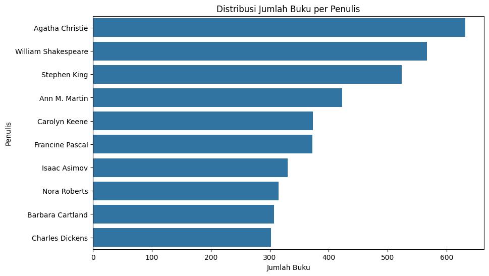
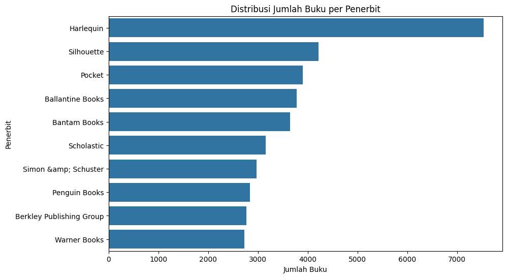
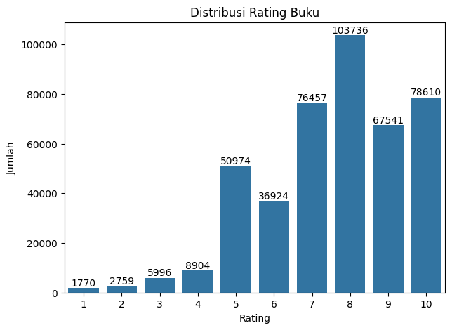
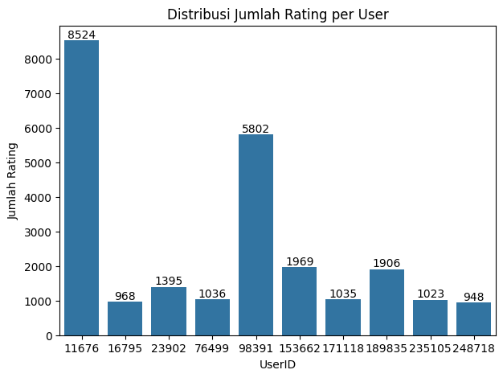
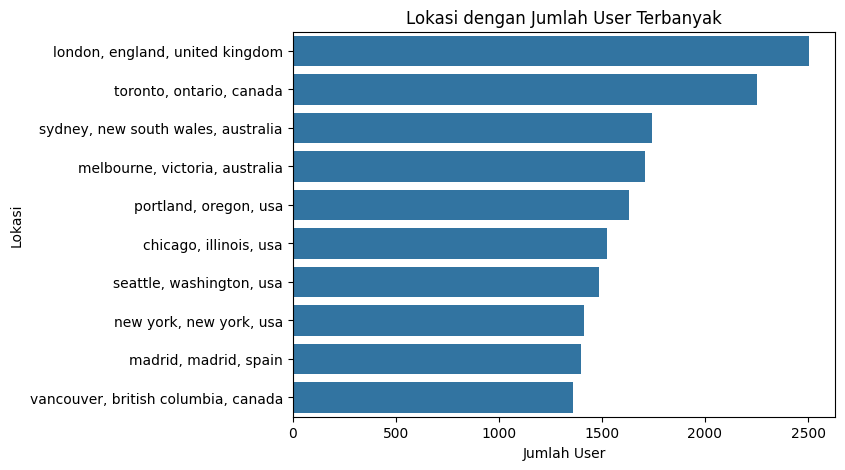
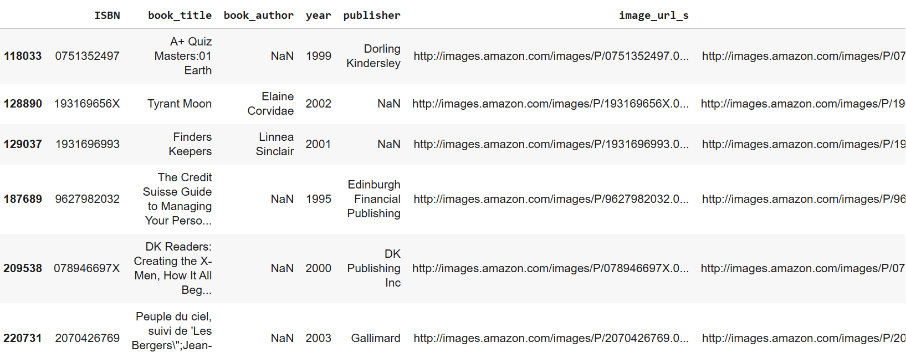
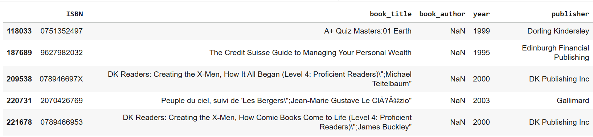
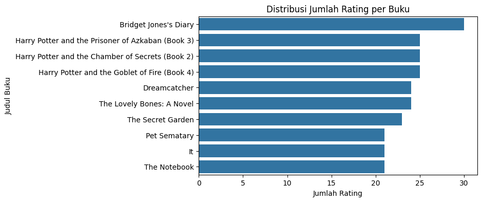
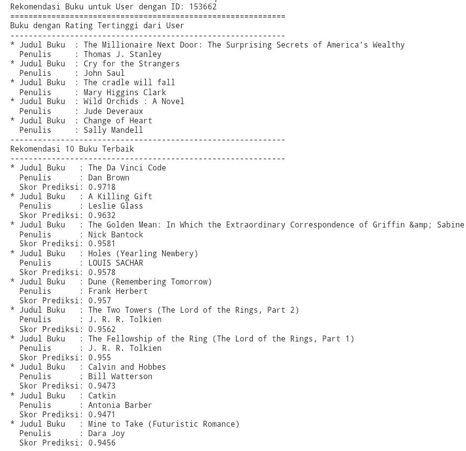
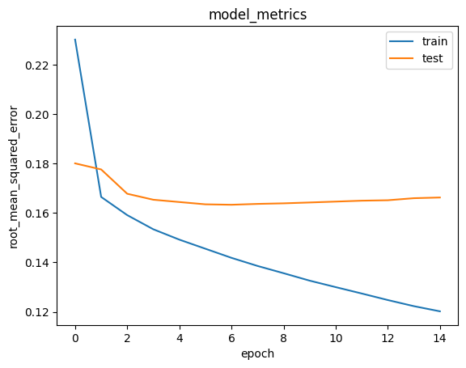

# Laporan Proyek Machine Learning - Bela Ismawati Nuraisa

## Project Overview

Perkembangan teknologi informasi yang pesat telah memicu ledakan konten dan informasi yang tersedia secara online (Ishak, Yahya A., & Yusri, 2025). Kondisi ini sering menimbulkan _information overload_, di mana pengguna kesulitan menemukan konten yang benar-benar sesuai dengan minat dan preferensi pribadi mereka (T. Li et al., 2023, _as cited in_ Ishak et al., 2025). Tantangan serupa juga terjadi di industri buku, baik cetak maupun digital (Isinkaye et al., 2015, _as cited in_ Ishak et al., 2025). Dengan jutaan judul yang tersedia, pembaca sering kesulitan mengidentifikasi buku yang sesuai dengan selera mereka di tengah pilihan yang hampir tak terbatas.

Salah satu cara mengatasi permasalahan tersebut adalah dengan memanfaatkan sistem rekomendasi. Sistem rekomendasi merupakan proses analisis dinamis yang dilakukan secara menyeluruh terhadap produk dan pelanggan, yang berfungsi mengatasi kelebihan informasi dengan memberikan rekomendasi yang spesifik sesuai keinginan pengguna (Jaja, Susanto, & Sasongko, 2020, _as cited in_ Adyatma & Baizal, 2023). Sistem rekomendasi kerap digunakan untuk merekomendasikan buku kepada pengguna (Ishak et al., 2025). Hal ini dilakukan dengan menyaring informasi dan memberikan rekomendasi yang dipersonalisasi kepada setiap pengguna. Dengan demikian, sistem ini tidak hanya mempermudah pengguna dalam menemukan buku yang sesuai dengan preferensi mereka, tetapi juga memberikan pengalaman pengambilan keputusan yang lebih baik dan efisien.

Referensi:
* Ishak, Yahya A., & Yusri. (2025). _Book Recommendation System Based on Collaborative Filtering: User-Based, Item-Based, and Singular Value Decomposition Analysis_. Journal of System and Computer Engineering (JSCE),  6(4), 329-342. https://doi.org/10.61628/jsce.v6i4.2201
* Adyatma, H., & Baizal, Z. K. A. (2023). _Book Recommender System Using Matrix Factorization with Alternating Least Square Method_. Journal of Information System Research (JOSH), 4(4), 1286-1292. https://doi.org/10.47065/josh.v4i4.3816

## Business Understanding

Berdasarkan latar belakang yang telah dijelaskan sebelumnya, berikut beberapa masalah yang ingin diselesaikan dalam proyek ini:

### Problem Statements

* Bagaimana cara membangun sistem rekomendasi yang dapat merekomendasi buku sesuai minat dan preferensi pengguna?
* Bagaimana cara mengevaluasi performa sistem rekomendasi agar kualitas rekomendasi yang diberikan sesuai dengan kebutuhan pengguna?

### Goals

- Membangun sistem rekomendasi buku yang dapat menyesuaikan rekomendasi dengan preferensi unik tiap pengguna.
- Mengevaluasi performa sistem rekomendasi untuk memastikan akurasi prediksi dan kualitas rekomendasi yang diberikan sesuai dengan kebutuhan pengguna.

### Solution statements

- Melakukan EDA (_Exploratory Data Analysis_) dan data preprocessing guna menyiapkan dataset sebelum masuk ke tahap modeling.
- Membangun sistem rekomendasi menggunakan Model Collaborative Filtering.
- Mengevaluasi performa model menggunakan metrik yang relevan, seperti RMSE (_Root Mean Square Error_)

## Data Understanding

Dataset yang digunakan merupakan dataset sekunder yang berasal dari [Kaggle](https://www.kaggle.com/datasets/arashnic/book-recommendation-dataset/data). Dataset ini dikumpulkan oleh Cai-Nicolas Ziegler dengan menggunakan proses _crawl_ (proses otomatis yang dilakukan oleh bot untuk menjelajahi, mengunduh, dan mengumpulkan informasi/data dari web) dari komunitas Book-Crossing dengan izin dari Ron Hornbaker, CTO Humankind Systems. Dataset ini terdiri dari 3 file, yang ditunjukkan sebagai berikut.

1. **Books:**
    * Berisi informasi mengenai buku yang diidentifikasi berdasarkan **ISBN**-nya.
    * Tersedia informasi berbasis konten: **Judul**, **Penulis** (hanya penulis pertama), **Tahun Terbit**, dan **Penerbit Buku** yang diperoleh dari Amazon.
    * Tersedia **URL gambar sampul** yang terdiri dalam 3 ukuran: 
        * Image-URL-S (kecil)
        * Image-URL-M (sedang)
        * Image-URL-L (besar)
    * Semua URL menuju ke situs Amazon.

2. **Ratings:**
    * Berisi informasi mengenai **Rating Buku**.
    * Rating eksplisit ditunjukkan dengan **skala 1-10** (nilai yang lebih tinggi menunjukkan apresiasi yang lebih tinggi).
    * Rating implisit ditunjukkan dengan **angka 0** (menandakan interaksi tanpa penilaian eksplisit).

3. **Users:**
    * Berisi data pengguna dengan **User-ID** yang telah dianonimkan dan dipetakan ke bilangan bulat.
    * Tersedia data demografis pengguna, seperti **Lokasi** dan **Usia**.
 
## _Exploratory Data Analysis_ (EDA) 

_Exploratory Data Analysis_ ([EDA](https://www.revou.co/kosakata/eda)) adalah proses analisis awal data yang bertujuan untuk memahami karakteristik, struktur, dan komponen penting dari dataset sebelum melakukan analisis statistik atau pemodelan prediktif lebih lanjut. Berikut adalah langkah-langkah EDA yang dilakukan pada proyek ini.

### **File Books**
**1. Deskripsi Data**
```
books.info()
```
Output:\
File Books terdiri dari 271.360 baris dan 8 kolom (ISBN, Book-Title, Book-Author, Year-Of-Publication, Publisher, Image-URL-S, Image-URL-M, dan Image-URL-L) dengan tipe data object.

**2. Informasi Variabel**
```
print('Jumlah buku: ', len(books.ISBN.unique()))
print('Jumlah judul buku: ', len(books.book_title.unique()))
print('Jumlah penulis buku: ', len(books.book_author.unique()))
print('Jumlah penerbit: ', len(books.publisher.unique()))
```

Output:
- Jumlah buku yang unik berdasarkan ISBN adalah 271.360 buku.
- Terdapat total 242.135 judul buku.
- Jumlah penulis buku adalah 102.023 penulis.
- Terdapat total 16.808 penerbit.

**3. Analisis Duplikasi pada Data**
```
print("Jumlah duplikasi pada books: ", books.duplicated().sum())
```

Output:\
Hasil dari syntax diatas menunjukkan bahwa tidak terdapat duplikasi pada data.

**4. Distribusi Data**

**a. Distribusi Jumlah Buku per Penulis**\
\
Interpretasi:\
Dari output tersebut, diketahui bahwa Agatha Christie menempati posisi teratas sebagai penulis dengan jumlah buku terbanyak, yang kemudian diikuti oleh William Shakespeare, Stephen King, dsb.

**b. Distribusi Jumlah Buku per Penerbit**\
\
Interpretasi:\
Dari output tersebut, diketahui bahwa Harlequin menempati posisi teratas sebagai penerbit dengan jumlah buku terbanyak, jauh melampaui penerbit lainnya.

### **File Ratings**
**1. Deskripsi Data**
```
ratings.info()
```
Output:\
File Ratings terdiri dari 1.149.780 baris dan 3 kolom (User-ID, ISBN, dan Book-Rating). ISBN bertipe data object, sedangkan User-ID dan Book-Rating bertipe data int64.

**2. Rangkuman Statistik Deskriptif**
|         |   UserID   | book_rating |	
|---------|------------|-------------|
|**count**|1.149780e+06| 1.149780e+06|
| **mean**|1.403864e+05| 2.866950e+00|
| **std** |8.056228e+04| 3.854184e+00|
| **min** |2.000000e+00| 0.000000e+00|
| **25%** |7.034500e+04| 0.000000e+00|
| **50%** |1.410100e+05| 0.000000e+00|
| **75%** |2.110280e+05| 7.000000e+00|
| **max** |2.788540e+05| 1.000000e+01|

Interpretasi:\
Dari output di atas, diketahui bahwa **nilai maksimum rating adalah 10** dan **nilai minimumnya adalah 0**. Tapi perlu diingat kembali, rating pada dataset ini dapat bersifat **eksplisit** (yang ditunjukkan dengan pemberian **nilai antara 1 sampai 10**) atau **implisit** (yang ditunjukkan dengan **nilai 0**).

Karena proyek ini akan berfokus pada Collaborative Filtering, maka rating yang digunakan adalah rating yang bersifat eksplisit. Sehingga rating yang bersifat implisit akan dihapus dari dataset.

**3. Informasi Variabel**
```
print('Jumlah buku: ', len(books.ISBN.unique()))
print('Jumlah judul buku: ', len(books.book_title.unique()))
print('Jumlah penulis buku: ', len(books.book_author.unique()))
print('Jumlah penerbit: ', len(books.publisher.unique()))
```

Output:
- Jumlah buku yang unik berdasarkan ISBN adalah 185.973 buku.
- Terdapat total 77.805 user.
- Terdapat total 433.671 rating.

**4. Analisis Duplikasi pada Data**
```
print("Jumlah duplikasi pada ratings: ", ratings.duplicated().sum())
```

Output:\
Hasil dari syntax diatas menunjukkan bahwa tidak terdapat duplikasi pada data.

**4. Distribusi Data**

**a. Distribusi Rating Buku**\
\
Interpretasi:
* Terdapat 103.736 user yang memberikan rating 8, yang berarti mayoritas pengguna cenderung memberikan penilaian positif terhadap buku yang mereka baca.
* Rating rendah (seperti 1, 2, dan 3) sangat jarang diberikan, yang berarti user jarang memberikan penilaian negatif.

**b. Distribusi Jumlah Rating per User**\
\
Interpretasi:\
Dari grafik ini diketahui bahwa user dengan ID 11676 merupakan user yang paling banyak memberikan rating buku, dengan total mencapai 8.524 rating. Posisi berikutnya diikuti oleh user dengan ID 98391 dengan total 5.802 rating.

### **File Users**
**1. Deskripsi Data**
```
users.info()
```
Output:\
File Users terdiri dari 278.858 baris dan 3 kolom (User-ID, Location, dan Age). User-ID bertipe data int64, Location bertipe data object, dan Age bertipe data float64.

**2. Rangkuman Statistik Deskriptif**
|         |   UserID   | book_rating |	
|---------|------------|-------------|
|**count**|278858.00000|168096.000000|
| **mean**|139429.50000|    34.751434|
| **std** | 80499.51502|    14.428097|
| **min** |     1.00000|     0.000000|
| **25%** | 69715.25000|    24.000000|
| **50%** |139429.50000|    32.000000|
| **75%** |209143.75000|    44.000000|
| **max** |278858.00000|   244.000000|

Interpretasi:\
Dari output di atas, diketahui bahwa rata-rata usia pengguna adalah 34.75 tahun. Kemudian, jika diperhatikan pada usia minimum dan maksimum pengguna, yaitu 0 dan 244 tahun, tentu tidak realistis. Oleh karena itu, akan dilakukan pengecekan lebih lanjut untuk bagian usia.

**3. Informasi Variabel**
```
print('Jumlah user: ', len(users.UserID.unique()))
print('Jumlah lokasi: ', len(users.location.unique()))
print('Data umur: ', users.age.unique())
```

Output:
- Terdapat total 278.858 user.
- Terdapat total 57.339 lokasi berbeda yang tercatat dari user, yang berarti user yang memberikan rating berasal dari berbagai tempat yang berbeda.
- Terdapat usia yang tidak realistis, dimana usia pelanggan berada dibawah 10 tahun atau diatas 100 tahun, dsb.

**4. Analisis Duplikasi pada Data**
```
print("Jumlah duplikasi pada users: ", users.duplicated().sum())
```

Output:\
Hasil dari syntax diatas menunjukkan bahwa tidak terdapat duplikasi pada data.

**4. Distribusi Data**

**Distribusi Jumlah User per Lokasi**
 \
Interpretasi:
* London menempati posisi teratas dengan jumlah user paling banyak, yang kemudian diikuti oleh Toronto dan Sydney.
* Kota‑kota dari Amerika Utara (AS dan Kanada) mendominasi daftar secara jumlah lokasi. 

## Data Preparation
Data Preparation adalah proses persiapan data sebelum dilakukan analisis atau pemodelan. Hal ini bertujuan untuk memastikan model dapat belajar secara efektif dan memberikan prediksi yang akurat.

#### 1. **File Books**
- **Analisis Missing Value**
    ```
    print(books.isna().sum())
    ```

    Output:
    |    Fitur    | _Missing_ |
    |-------------|-----------|
    |     ISBN    |          0|
    | book_title  |          0|
    | book_author |          2|
    |     year    |          0|
    |  publisher  |          2|
    | image_url_s |          0|
    | image_url_m |          0|
    | image_url_l |          3|
    
    Interpretasi:\
    Berdasarkan hasil output tersebut, diketahui bahwa terdapat 3 fitur yang memiliki _missing value_, yaitu kolom book_author, publisher, dan image_url_l. Karena kolom publisher dan image_url_l tidak akan digunakan dalam proyek ini, maka nilai NaN yang ada akan dibiarkan. Sehingga penanganan _missing value_ akan berfokus ke kolom book_author.

- **Penanganan _Missing Value_**\
    **1. Mengecek baris yang memiliki _missing value_**\
    \
    Interpretasi:\
    Dari output tersebut, diketahui bahwa ISBN dengan nomor 078946697X, 2070426769, dan 0789466953 mengalami _missalignment_ kolom, dimana nilai book_author diisi dengan nilai dari year, dan seterusnya.

    **2. Mengatasi _missalignment kolom_**
    ```
    def fix_row(row):
    if str(row['book_author']).isdigit():
        # Menggeser nilai ke kolom yang benar
        row['image_url_l'] = row['image_url_m']
        row['image_url_m'] = row['image_url_s']
        row['image_url_s'] = row['publisher']
        row['publisher'] = row['year']
        row['year'] = int(row['book_author'])
        row['book_author'] = np.nan
    return row
    ```
    
    **3. Mengecek baris yang mengalami _missalignment_ kolom**\
    \
    Interpretasi:\
    Dari output tersebut, diketahui bahwa book_author dari ISBN dengan nomor 078946697X, 2070426769, dan 0789466953 salah input di kolom book_title. Oleh karena itu, akan dilakukan penanganan dengan menggunakan syntax berikut.
    ```
    # Contoh penanganan misalignment untuk satu ISBN
    books.loc[books.ISBN == '078946697X','book_author'] = "Michael Teitelbaum"
    books.loc[books.ISBN == '078946697X','book_title'] = (
    "DK Readers: Creating the X-Men, How It All Began (Level 4: Proficient Readers)"
    )
    ```
    
    **4. Menghapus book_author yang bernilai NaN**
    ```
    books_clean = books.dropna(subset=['book_author'])
    ```

#### 2. **File Ratings**
- **Analisis _Missing Value_**
    ```
    print(ratings.isna().sum())
    ```
    Output:\
    Hasil dari syntax diatas menunjukkan bahwa tidak terdapat _missing value_ pada data.

- **Analisis User Aktif (User dengan >200 Rating)**\
    Analisis ini bertujuan untuk mengambil user yang memberikan rating pada lebih dari 200 buku. Hal ini dilakukan guna memastikan kualitas data yang akan digunakan cukup informatif, sehingga dapat menghasilkan rekomendasi yang relevan. Selain itu, hal ini juga membantu meningkatkan efisiensi komputasi karena ukuran data yang diproses menjadi lebih terkontrol, sehingga proses training model berjalan lebih cepat tanpa kehilangan informasi penting. 
    ```
    user_rating_counts = ratings['UserID'].value_counts()
    active_users_mask = user_rating_counts > 200
    active_users = active_users_mask[active_users_mask].index
    ratings = ratings[ratings['UserID'].isin(active_users)]
    ```

#### 3. **File Users**
- **Analisis _Missing Value_**
    ```
    print(users.isna().sum())
    ```
    Output:\
    Diketahui bahwa kolom age memiliki _missing value_, dengan total mencapai 110.762 data. Karena kolom ini tidak akan digunakan untuk membangun model dan juga memiliki nilai yang tidak realisitis, maka kolom ini akan dihapus dengan menggunakan syntax berikut.
    ```
    users_clean = users.drop('age', axis=1)
    ```

#### 4. **Merge File Ratings dengan File Books**
- **Menggabungkan file ratings dan file books berdasarkan ISBN**
    ```
    books_selected = books_clean[['ISBN', 'book_title', 'book_author']]
    book_final = pd.merge(ratings, books_selected, on='ISBN', how='inner')
    ```

- **Visualisasi untuk melihat distribusi data**\
  **1. Distribusi Jumlah Rating per Buku**\
  \
  Interpretasi:\
  Dari grafik tersebut, diketahui bahwa Buku Bridget Jones's Diary menempati posisi teratas dengan jumlah rating tertinggi, dengan total lebih dari 30 rating. Kemudian diikuti oleh 3 buku dari seri Harry Potter (Book 2, 3, dan 4), dengan total sekitar 25 rating.\
  **2. Distribusi Rating Berdasarkan Penulis**\
  \
  Interpretasi:\
  Dari grafik tersebut, diketahui bahwa buku yang ditulis oleh Stephen King menjadi buku yang paling banyak diberi rating, dengan total mencapai lebih dari 700 rating.

- **Melakukan Encoding**\
    [Encoding](https://blog.rumahweb.com/encoding-dan-decoding-adalah/#:~:text=Apa%20itu%20Encoding?%20Encoding%20adalah%20proses%20mengubah,bentuk%20aslinya%20dengan%20aman%2C%20tanpa%20kehilangan%20informasi.) merupakan proses mengubah data dari satu bentuk ke bentuk lain agar dapat disimpan atau diproses dengan lebih efisien. Pada proyek ini, encoding dilakukan pada kolom UserID dan ISBN. Hal ini dilakukan dengan mengubah format kedua kolom tersebut menjadi representasi numerik.

- **Membagi Dataset**\
    Pada proyek ini, dataset dibagi menjadi $$80$$% data train dan $$20$$% data validasi. Hal ini bertujuan untuk mengukur seberapa baik model akan bekerja pada data yang belum pernah dilihat sebelumnya. Dengan tahap ini, akan diketahui apakah model benar-benar belajar pola yang berguna atau hanya menghafal data. 
    Sebelum dibagi, dataset akan diacak (_shuffling_) terlebih dahulu. Hal ini bertujuan untuk menghindari bias dan menjamin distribusi data yang representatif.
    ```
    train_indices = int(0.8 * dataset.shape[0])
    x_train, x_val, y_train, y_val = (x[:train_indices],
                                      x[train_indices:],
                                      y[:train_indices],
                                      y[train_indices:])
    ```
    
## Modeling
Sistem rekomendasi yang dibangun pada proyek ini menggunakan model-based collaborative filtering yang dikembangkan dengan teknik _deep learning_. [Collaborative Filtering](https://dqlab.id/collaborative-filtering-pada-algoritma-data-science) merupakan salah satu metode yang digunakan untuk memberikan rekomendasi kepada pengguna berdasarkan data historis tentang preferensi pengguna lain. [Hal](https://www.ibm.com/id-id/think/topics/collaborative-filtering) ini dilakukan dengan mengelompokkan pengguna berdasarkan perilaku dan menggunakan karakteristik kelompok secara umum untuk merekomendasikan item kepada pengguna target. 

Tidak seperti content-based methods, [collaborative filtering](https://journal.unpacti.ac.id/index.php/JSCE/article/view/2201/1201) tidak membutuhkan informasi deskriptif tentang item karena dibangun dengan memanfaatkan pola interaksi antara pengguna dan item. Meskipun demikian, metode ini masih sulit untuk memberikan rekomendasi kepada pengguna baru (belum ada riwayat interaksi) atau item baru (belum ada rating/klik) yang belum memiliki data peringkat yang cukup. 

Dalam proses pengembangan model, dilakukan embedding pada user, book, dan bias masing‑masingnya guna memastikan entitas memiliki representasi numerik yang dapat dipelajari. Kemudian, dilakukan operasi perkalian _dot product_ antara embedding user dan book untuk mengukur tingkat kecocokan di ruang laten. Nilai ini kemudian ditambahkan dengan bias dari setiap user dan book untuk menyesuaikan preferensi individu maupun popularitas item. Hasil akhirnya dilewatkan ke fungsi aktivasi sigmoid, yang mengubah skor menjadi probabilitas antara $$0$$ dan $$1$$. Probabilitas ini dapat ditafsirkan sebagai kemungkinan seorang pengguna menyukai atau berinteraksi dengan buku tertentu. 

Hasil rekomendasi yang dihasilkan dapat ditunjukkan sebagai berikut.\


## Evaluation
Pada tahap ini, evaluasi dilakukan dengan menggunakan metrik RMSE (_Root Mean Square Error_). [Metrik](https://journal.unpacti.ac.id/index.php/JSCE/article/view/2201/1201) ini digunakan untuk mengukur seberapa dekat nilai yang diprediksi dengan nilai aktual pengguna. Metrik RMSE bernilai $$0$$ menunjukkan prediksi yang sempurna dan nilai yang lebih tinggi menunjukkan deviasi yang lebih besar. Hal ini berarti semakin rendah nilai RMSE, maka semakin baik performa model dalam merekomendasikan item relevan dan disukai oleh pengguna.

Rumus RMSE:\
$$RMSE = \sqrt{\frac{1}{n}\sum_{i=1}^{n}(y_i - \hat{y}_i)^2}$$

Dimana:\
$$n$$ adalah jumlah sampel dalam data\
$$y_i$$ adalah nilai aktual\
$$\hat{y}_i$$ adalah nilai prediksi

Hasil dari metrik RMSE ditunjukkan dalam gambar berikut.\
\
Interpretasi:
* Diperoleh nilai RMSE sebesar 0.1196 untuk data pelatihan dan 0.1663 untuk data validasi.
* Dari grafik terlihat bahwa nilai RMSE terus menurun pada data pelatihan, yang berarti model berhasil mempelajari pola dari data dengan baik. Namun, RMSE pada data validasi menunjukkan tren stagnan dan sedikit meningkat di akhir pelatihan, yang mengindikasikan potensi _overfitting_ (model terlalu menyesuaikan diri dengan data pelatihan sehingga performa pada data baru menurun).
